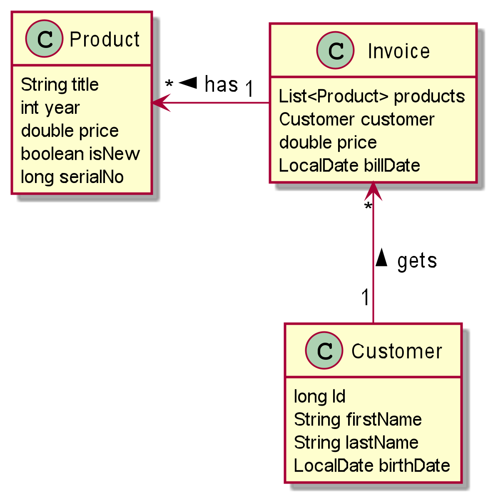
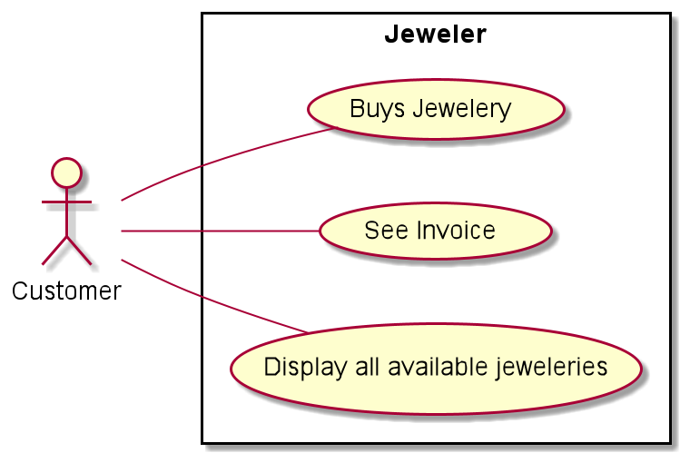

# Jeweler

## Description

    It's an Webprogram which uses CRUD Functions. Swagger is the tool for the documentation. For the Testing
    we use http-request.
    
    The Project is a Jewelerstore where a costumer can buy products.

    Every jewellery is unique. So one jewellery can only have one invoice.
    
## Classdiagram



## Usecasediagram  

  

## Getting Started
Start Database:
```bash
docker run --ulimit memlock=-1:-1 -it --rm --memory-swappiness=0 \
           --name postgres-db -e POSTGRES_USER=app \
           -e POSTGRES_PASSWORD=app -e POSTGRES_DB=db \
           -p 5432:5432 postgres:12.4
```
Start Prgram:
```bash
./mvnw clean compile quarkus:dev
```

## REST-Documentation
Swagger: http://localhost:8080/swagger-ui/

## Checklist
- [x] Zuerst ist das Backend sauber zu erstellen (Ordner backend im Repository)
- [x] Die Tabellen und deren Assoziationen müssen korrekt sein und mind. der 3.NF entsprechen
- [x] Bei den Endpoints dürfen nicht nur die Daten jeweils einer Entität (Tabelle) zurückgegeben werden, sondern es ist mindestens eine Query zu erstellen, die aus mehreren Tabellen Daten zurück gibt.
- Auch sind die Werte zu filtern:
    - [x] zumindest einmal mit QueryParams
    - [x] zumindest einmal mit PathParams
- Mindestens ein Endpoint muss
  - [x] einen GET-Request
  - [x] einen POST-Request
  - [x] einmal mit nur einem Objekt und
  - [x] einmal mit mehreren Objekten
  - [x] einen PUT-Request
  - [ ] einen PATCH-Request
  - [x] und einen DELETE-Request beinhalten
  
- [x] Es ist zumindest ein request.http - File im http-requests - Ordner zu erstellen, damit die Abfrage der Endpoints dokumentiert ist
  
- In der README.md ist eine sehr rudimentäre Dokumentation enthalten:
  - [x] Datenmodell
  - [x] Use-Case mit UCD: Es sind spezielle Use-Cases für das jeweilige Thema zu implementieren
  - [x] Infos über die Endpoints - dies kann und soll durch einen Swagger ersetzt werden → Link auf Swagger angeben
  - [ ] Die Default-Swagger-Infos können und sollen durch Annotationen ergänzt werden.
  - [x] Die Angabe soll als Checkliste angegeben sein, damit auf einen Blick ersichtlich ist, was gemacht wurde.
  - [x] Wie startet man das Projekt.
