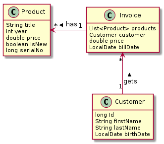

# Jeweler

## Description

    It's an Webprogram which uses CRUD Functions. Swagger is the tool for the documentation. For the Testing
    we use http-request.
    
    The Project is a Jewelerstore where a costumer can buy products.

    Every jewellery is unique. So one jewellery can only have one invoice.
    
## Classdiagram



## Usecasediagram  

  

## Getting Started
Start Database:
```bash
docker run --ulimit memlock=-1:-1 -it --rm --memory-swappiness=0 \
           --name postgres-db -e POSTGRES_USER=app \
           -e POSTGRES_PASSWORD=app -e POSTGRES_DB=db \
           -p 5432:5432 postgres:12.4
```
Start Prgram:
```bash
./mvnw clean compile quarkus:dev
```

## REST-Documentation
Swagger: http://localhost:8080/swagger-ui/
